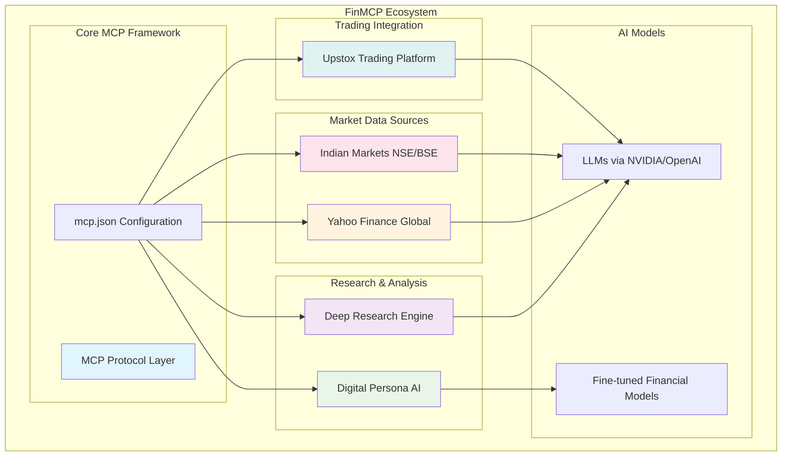

# FinMCP: Comprehensive Financial AI Ecosystem

[](https://opensource.org/licenses/MIT)
[](https://www.python.org/downloads/)
[](https://www.typescriptlang.org/)

> **A unified Model Context Protocol (MCP) ecosystem for financial AI applications, providing deep research capabilities, trading integrations, and specialized AI model training for financial analysis.**

## 🎯 Overview

FinMCP is a comprehensive suite of interconnected financial AI tools designed to democratize institutional-grade financial analysis. Built on the Model Context Protocol (MCP) framework, it provides seamless integration between AI models and financial data sources, enabling sophisticated analysis, automated trading insights, and specialized AI model development for the financial domain.

Demo Video Link :-  https://drive.google.com/file/d/1sWKAB2K62oUG14YtS5YqEo72Unr9xfq3/view?usp=sharing

### Key Innovations

- **🔬 Deep Research Engine**: AI-powered iterative research with web scraping and synthesis
- **📈 Multi-Market Integration**: Real-time data from Indian (NSE/BSE) and global markets (Yahoo Finance)
- **🏦 Trading Platform Integration**: Direct connectivity with Upstox brokerage services
- **🧠 Specialized AI Training**: Financial document analysis and LLM fine-tuning pipelines
- **🔌 MCP Architecture**: Standardized protocol for AI model connectivity

## 🏗️ Architecture



## 🚀 Quick Start

### Prerequisites

- **Python 3.8+** with pip
- **Node.js 16+** with npm
- **Git** with submodule support
- **API Keys**: NVIDIA, OpenAI, Firecrawl, Upstox (as needed)

### Installation

1. **Clone the repository with submodules:**
```bash
git clone --recursive https://github.com/Finance-LLMs/FinMCP.git
cd FinMCP
```

2. **Update submodules to latest:**
```bash
git submodule update --init --remote --merge --recursive
```

3. **Configure MCP servers:** (See [Configuration](#-configuration) section)

4. **Install dependencies for each module:** (See individual module sections)

## 📦 Core Modules

### 🔬 Deep Research Engine
*Location: `Deep-Research/`*

An AI-powered research assistant that performs iterative, comprehensive research on any financial topic by combining search engines, web scraping, and large language models.

**Key Features:**
- **Iterative Research**: Multi-depth analysis with configurable breadth and depth
- **Multiple AI Providers**: NVIDIA, OpenAI, Fireworks AI, and local model support
- **Intelligent Query Generation**: Context-aware search strategy development
- **Concurrent Processing**: Parallel search and analysis for efficiency
- **Comprehensive Reports**: Structured markdown outputs with citations

**Quick Setup:**
```bash
cd Deep-Research
pip install -r requirements.txt
cp .env.example .env.local
# Configure API keys in .env.local
python -m src.run
```

**API Endpoints:**
- `POST /api/research` - Perform research and get concise answers
- `POST /api/generate-report` - Generate detailed research reports

### 🏦 Upstox Trading Integration
*Location: `Upstox-MCP-Server/`*

Official MCP server implementation for Upstox trading platform integration, providing real-time trading data and order management capabilities.

**Key Features:**
- **Real-time Portfolio Data**: Holdings, positions, and MTF information
- **Order Management**: Order book, history, and trade details
- **Funds & Margin**: Account balance and margin calculations
- **Professional API**: RESTful endpoints with comprehensive error handling

**Quick Setup:**
```bash
cd Upstox-MCP-Server
npm install
npm run start
```

**Available Tools:**
- Profile information and active segments
- Funds and margin details by segment
- Holdings and positions tracking
- Complete order lifecycle management
- Real-time trade execution data

### 🧠 Digital Persona AI
*Location: `Digital-Persona/`*

Advanced financial document analysis system that extracts insights from PDFs and creates structured Question-Answer-Reasoning datasets for fine-tuning specialized financial AI models.

**Key Features:**
- **Advanced OCR**: EasyOCR-powered text extraction from financial documents
- **Large Context Analysis**: Handles up to 120K tokens for comprehensive understanding
- **QAR Dataset Generation**: Professional-grade question-answer-reasoning triplets
- **Model Fine-tuning**: LoRA-based efficient training with 4-bit quantization
- **Performance Comparison**: Original vs fine-tuned model evaluation

**Processing Options:**
```bash
cd Digital-Persona

# NVIDIA API (Recommended for quality)
python generate_QAR_triplets_from_pdf.py

# Local GPU processing
python generate_QAR_local_GPU.py

# Enhanced NVIDIA implementation
python qarNvidiaAPI.py

# Fine-tune models
python finetune.py

# Compare performance
python inference.py
```

### 📊 Market Data Services

#### 🌍 Yahoo Finance Global Markets
*Location: `Yahoo-Finance/main.py`*

Comprehensive global market data integration using Yahoo Finance API.

**Capabilities:**
- Real-time stock prices and company information
- Historical data analysis and stock splits
- Market indices and sector performance
- Dividend history and financial metrics
- Options data and earnings calendars

#### 🇮🇳 Indian Markets Integration
*Location: `Indian-Markets/indian_markets.py`*

Specialized integration for Indian stock markets (NSE/BSE) with real-time data.

**Features:**
- NSE real-time quotes and indices (NIFTY 50, SENSEX)
- BSE market data with caching support
- Intraday and 52-week high/low tracking
- Volume analysis and market depth
- Symbol purification and error handling

## ⚙️ Configuration

### MCP Server Configuration

The `mcp.json` file configures all MCP servers for integration with AI assistants:

```json
{
  "mcpServers": {
    "mcp-server-upstox-api": {
      "command": "npx",
      "args": ["mcp-remote", "http://localhost:8787/sse"]
    },
    "Stocks": {
      "command": "uv",
      "args": ["run", "--with", "mcp[cli]", "--with", "yfinance", "mcp", "run", "Yahoo-Finance/main.py"]
    },
    "IndianMarkets": {
      "command": "uv", 
      "args": ["run", "--with", "mcp[cli]", "--with", "bse", "--with", "nsepython", "mcp", "run", "Indian-Markets/indian_markets.py"]
    },
    "deep-research-python": {
      "command": "python3",
      "args": ["Deep-Research/mcp_deep_research.py"],
      "env": {
        "PYTHONPATH": "Deep-Research/"
      }
    }
  }
}
```

### Environment Variables

Create `.env.local` files in relevant modules:

```bash
# Deep Research
FIRECRAWL_KEY="your_firecrawl_key"
NVIDIA_API_KEY="your_nvidia_api_key"
OPENAI_KEY="your_openai_key"

# Digital Persona
NVIDIA_API_KEY="nvapi-your-key-here"
HF_TOKEN="hf_your-token-here"

# Upstox (configure through OAuth)
UPSTOX_CLIENT_ID="your_client_id"
UPSTOX_CLIENT_SECRET="your_client_secret"
```

## 🔧 Usage Examples

### Deep Financial Research

```python
# Natural language research queries
"Analyze Tesla's Q4 2024 financial performance and competitive position"
"Compare renewable energy sector growth prospects across different markets"
"Research impact of Federal Reserve policy changes on banking sector"
```

### Trading Portfolio Analysis

```python
# Portfolio management queries
"What's my current portfolio performance in Upstox?"
"Show me my top performing holdings this month"
"Analyze my sector allocation and suggest rebalancing"
"What are my unrealized gains/losses across positions?"
```

### Market Data Analysis

```python
# Market analysis queries  
"Get NIFTY 50 current levels and top gainers"
"Compare Apple's performance against NASDAQ index"
"Analyze Indian banking sector stocks performance"
"Show me dividend yield analysis for my holdings"
```

### AI Model Training

```python
# Document analysis and model training
"Extract financial insights from this annual report"
"Generate QAR dataset from earnings call transcripts"
"Fine-tune model for equity research analysis"
"Compare performance of original vs specialized financial model"
```

## 🏗️ Development

### Adding New MCP Servers

1. **Create new module directory:**
```bash
mkdir Your-New-Module
cd Your-New-Module
```

2. **Implement MCP server:**
```python
from mcp.server.fastmcp import FastMCP

mcp = FastMCP("YourServerName")

@mcp.tool()
def your_financial_tool(parameter: str) -> dict:
    """Your tool description"""
    # Implementation
    return {"result": "data"}

if __name__ == "__main__":
    mcp.run()
```

3. **Update mcp.json configuration:**
```json
{
  "mcpServers": {
    "your-server": {
      "command": "python",
      "args": ["Your-New-Module/server.py"]
    }
  }
}
```

### Testing and Validation

```bash
# Test individual modules
cd Deep-Research && python -m pytest tests/
cd Upstox-MCP-Server && npm test
cd Digital-Persona && python test_functionality.py

# Validate MCP configurations
mcp validate mcp.json
```

## 📊 Performance & Scalability

### Resource Requirements

| Module | CPU | RAM | GPU | Storage |
|--------|-----|-----|-----|---------|
| Deep Research | 2+ cores | 4GB | Optional | 1GB |
| Upstox Server | 1+ core | 2GB | None | 500MB |
| Digital Persona | 4+ cores | 16GB | 24GB VRAM | 10GB |
| Market Data | 1+ core | 2GB | None | 1GB |

### Optimization Strategies

- **Concurrent Processing**: Parallel API calls and data processing
- **Caching**: Redis/local caching for frequently accessed data
- **Rate Limiting**: Intelligent throttling for API compliance
- **Memory Management**: Efficient context handling for large documents

## 🛡️ Security & Compliance

### API Security
- **Token Management**: Secure storage and rotation of API keys
- **Rate Limiting**: Built-in protection against API abuse
- **Error Handling**: Comprehensive error management and logging

### Data Privacy
- **Local Processing**: Option for on-premise document analysis
- **Encryption**: API communications over HTTPS/WSS
- **Access Control**: Role-based access to trading functions

### Financial Compliance
- **Audit Trails**: Comprehensive logging of all trading activities
- **Risk Management**: Built-in safeguards for trading operations
- **Regulatory Compliance**: Adherence to financial data usage regulations

## 📄 License

This project is licensed under the MIT License - see the [LICENSE](LICENSE) file for details.

## 🙏 Acknowledgments

- **MIDAS Lab, IIIT-Delhi** - Research and development support
- **Model Context Protocol** - Standardized AI integration framework
- **Financial Data Providers** - Yahoo Finance, NSE, BSE, Upstox
- **AI Platform Partners** - NVIDIA, OpenAI, Fireworks AI
- **Open Source Community** - Various libraries and tools

---

**Built with ❤️ for the Financial AI Community**

*Empowering institutional-grade financial analysis through advanced AI and seamless data integration.*
